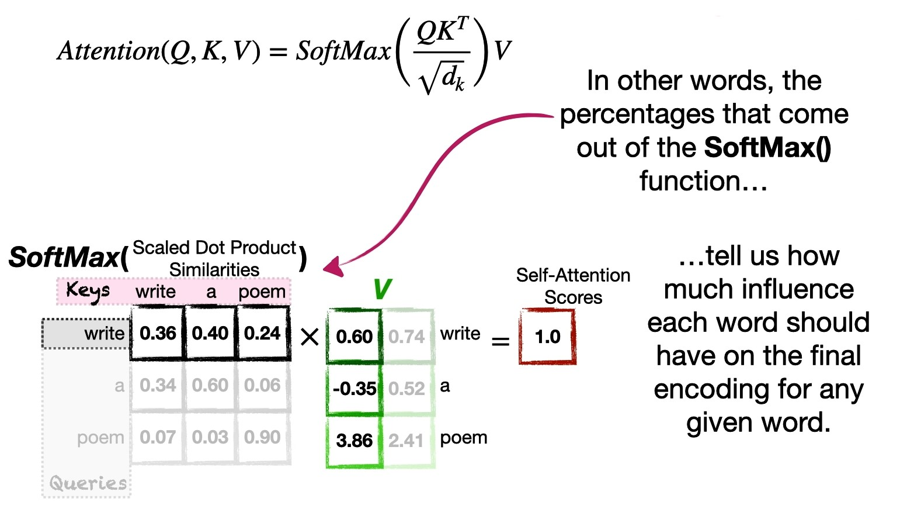

# Attention in Transformers: Concepts and Code in PyTorch

Notes from the short course [Attention in Transformers: Concepts and Code in PyTorch](https://learn.deeplearning.ai/courses/attention-in-transformers-concepts-and-code-in-pytorch) by [Josh Starmer](https://statquest.org/about/).

# Disclaimer

These notes are for my own backups and for future readings. All mistakes are my own.

Screenshots and quotes are taken as they appear or modified from the ones on the course website.

